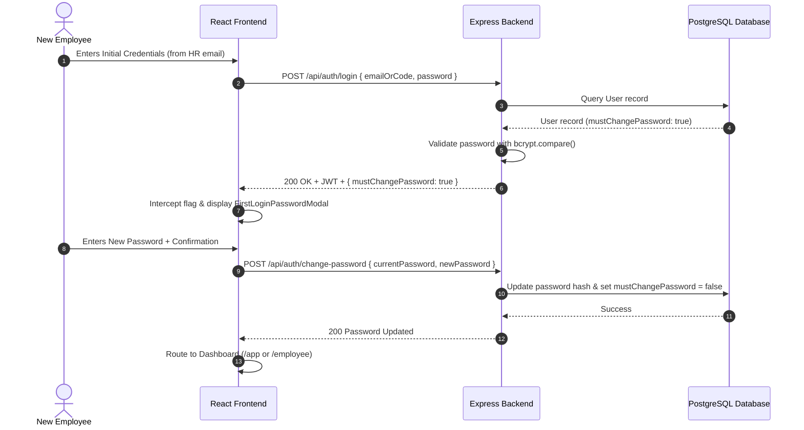
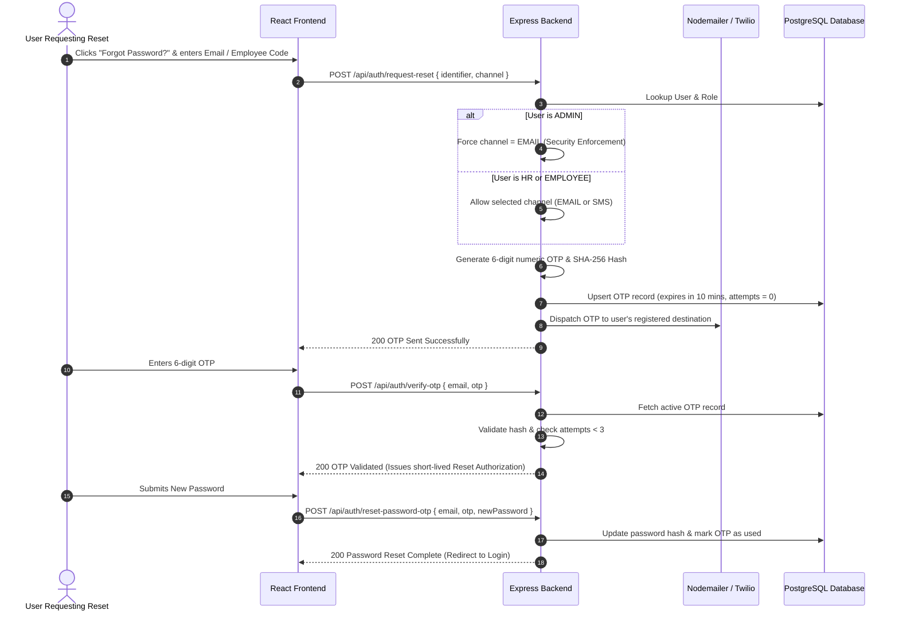
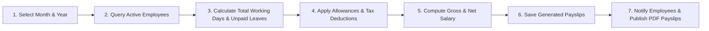
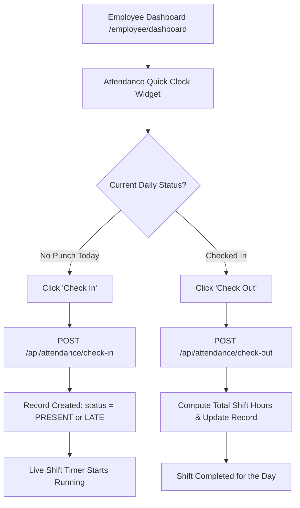
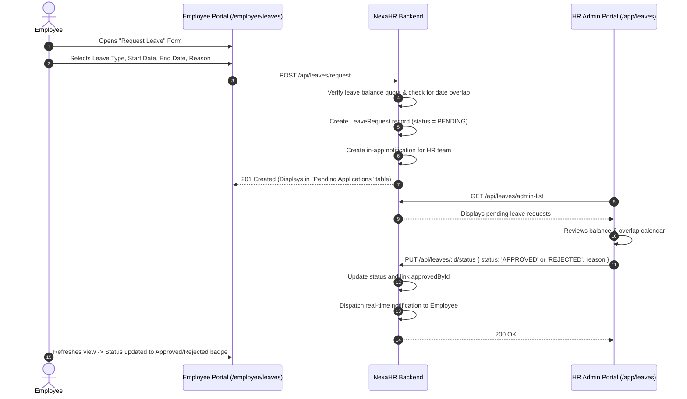
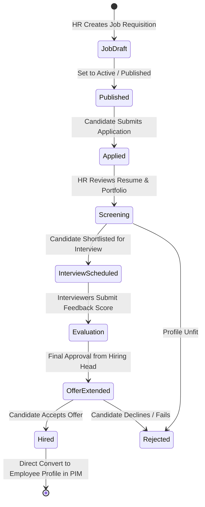

# 🔄 NexaHR — Application Flow & User Journeys

**System Name:** NexaHR Enterprise Human Resource Management System (HRMS)  
**Version:** `2.0.0 Enterprise`  
**Document Classification:** User Journey Mapping & Operational Process Flows  

---

## 1. High-Level Flow Topology

```mermaid
flowchart TD
    Start([User Arrives at NexaHR]) --> Login[Secure Login Page '/']
    Login --> AuthCheck{Credentials Valid?}
    AuthCheck -- No --> LoginError[Display Error Message]
    AuthCheck -- Yes --> ForcePassCheck{mustChangePassword == true?}
    
    ForcePassCheck -- Yes --> FirstPassModal[Mandatory Password Change Modal]
    FirstPassModal --> UpdatePass[Save New Strong Password]
    UpdatePass --> RoleRoute
    
    ForcePassCheck -- No --> RoleRoute{User Role?}
    
    RoleRoute -- ADMIN / HR_MANAGER --> HRApp[/app/dashboard - HR Management Portal]
    RoleRoute -- EMPLOYEE --> EmpApp[/employee/dashboard - Employee Self-Service Portal]
    
    subgraph HR_PORTAL [HR Management Ecosystem]
        HRApp --> PIM[Employee Directory & Onboarding]
        HRApp --> AttendMgmt[Attendance & Biometric Logs]
        HRApp --> LeaveReview[Leave Approval Workflows]
        HRApp --> PayrollRun[Automated Monthly Payroll]
        HRApp --> Recruitment[ATS Recruitment Pipeline]
        HRApp --> SecControl[User Access & Security Control]
    end

    subgraph ESS_PORTAL [Employee Self-Service Ecosystem]
        EmpApp --> ClockInOut[Daily Attendance Punch In/Out]
        EmpApp --> ApplyLeave[Leave Application Submission]
        EmpApp --> ViewPayslip[Payslip Breakdown & PDF Export]
        EmpApp --> Helpdesk[Internal Inquiries & Tickets]
        EmpApp --> OrgDocs[Handbooks & Corporate News]
    end
```

---

## 2. Authentication & Credential Flows

### 2.1 First-Time Login & Mandatory Security Setup


### 2.2 Multi-Channel OTP Password Recovery Flow


---

## 3. Core HR Operational Workflows

### 3.1 Employee Onboarding & Lifecycle Management
1. **Initiation:** HR Manager navigates to `/app/hr/new-employee`.
2. **Data Ingestion:**
   - **Personal Information:** First Name, Last Name, Corporate Email, Phone, Date of Birth, Gender, Address, Emergency Contact.
   - **Organizational Alignment:** Department selection (auto-loads matching Designations), Employment Type (Full-time, Part-time, Contract), Shift schedule.
   - **Compensation Structure:** Basic Salary, Housing Allowance, Transport Allowance, Other Allowances, Statutory Tax, Deductions.
   - **Avatar Capture:** File upload with automatic Cloudinary stream and face crop.
3. **Atomic Persistence:** Backend executes an atomic transaction:
   - Creates `User` with auto-formatted `EMP-XXX-NNN` code and temporary password.
   - Creates `EmployeeProfile` linked to `Department` and `Designation`.
   - Creates `SalaryStructure` linked to `User`.
4. **Notification Dispatch:** System generates an in-app welcome notification and sends onboarding credentials to the employee's email.

### 3.2 Monthly Payroll Processing Lifecycle


1. HR navigates to `/app/payroll/calculate`.
2. Selects Target Payroll Period (e.g. `September 2026`).
3. Clicks **"Process Payroll"**:
   - The engine iterates over every active employee with a registered `SalaryStructure`.
   - Checks `LeaveRequest` records for unpaid leave days within the period.
   - Formulates:
     $$\text{Gross} = \text{Basic} + \text{Housing} + \text{Transport} + \text{Other}$$
     $$\text{Unpaid Deduction} = \left(\frac{\text{Gross}}{30}\right) \times \text{Unpaid Days}$$
     $$\text{Net Salary} = \text{Gross} - \text{Tax} - \text{Other Deductions} - \text{Unpaid Deduction}$$
4. Results are previewed in an interactive table with options to inspect individual breakdowns.
5. HR clicks **"Finalize & Publish Payslips"**, which writes records to the `payslips` table with status `GENERATED` and broadcasts in-app notifications to all employees.

---

## 4. Employee Self-Service (ESS) Workflows

### 4.1 Daily Attendance Punch In / Out


### 4.2 Leave Application & Adjudication Flow


---

## 5. Recruitment & Applicant Tracking (ATS) Flow



---

## 6. Real-Time Notification & In-App Alerts Flow

1. **Trigger Event Occurs:**
   - Leave status updated (Approved / Rejected)
   - Monthly payslip published
   - Company announcement broadcasted
   - Security password changed
2. **Notification Dispatcher:**
   - Service writes a new row to `Notification` table with category (`LEAVE`, `PAYROLL`, `ANNOUNCEMENT`, `ATTENDANCE`).
   - If user has unread notifications, the header bell badge shows dynamic count and pulsing beacon.
   - Clicking notification navigates straight to deep-linked context route (`link: "/employee/payslips"`).
