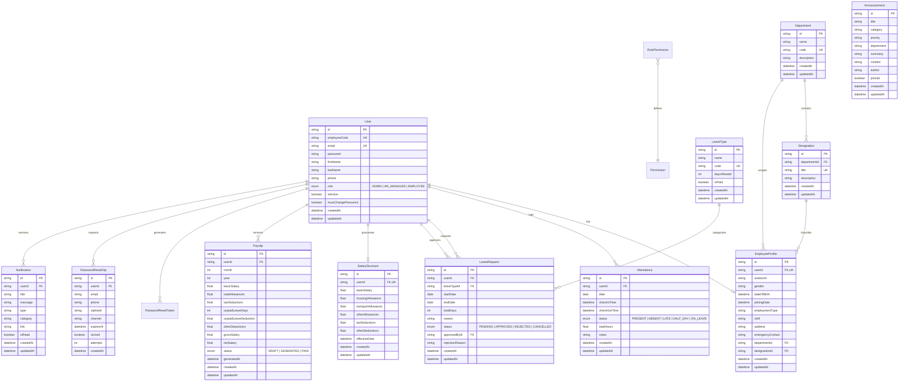

# 🗄️ NexaHR — Backend Schema & Database Architecture

**Database Engine:** PostgreSQL  
**ORM:** Prisma ORM v5.22  
**Schema Architecture:** Relational with Strict Foreign Key Constraints, Indexes, and ACID Transactions  
**Document Status:** Production Reference Specification  

---

## 1. Entity Relationship Diagram (ERD)



---

## 2. Complete Data Model DDL & Field Specifications

### 2.1 Enums

```prisma
enum Role {
  ADMIN
  HR_MANAGER
  EMPLOYEE
}

enum AttendanceStatus {
  PRESENT
  ABSENT
  LATE
  HALF_DAY
  ON_LEAVE
}

enum LeaveStatus {
  PENDING
  APPROVED
  REJECTED
  CANCELLED
}

enum PayslipStatus {
  DRAFT
  GENERATED
  PAID
}
```

---

### 2.2 Core Models & Attributes

#### `User` (Table: `users`)
| Field | Type | Attributes | Description |
| :--- | :--- | :--- | :--- |
| `id` | `String` | `@id @default(uuid())` | Primary key unique UUID |
| `employeeCode` | `String` | `@unique` | Corporate code (e.g. `EMP-ADMIN-001`) |
| `email` | `String` | `@unique` | Corporate email for login & mailers |
| `password` | `String` | — | Bcrypt salted hash ($10\text{ rounds}$) |
| `firstName` | `String` | — | Employee given name |
| `lastName` | `String` | — | Employee family name |
| `phone` | `String?` | — | Phone number with country code |
| `role` | `Role` | `@default(EMPLOYEE)` | System access tier (`ADMIN`, `HR_MANAGER`, `EMPLOYEE`) |
| `isActive` | `Boolean` | `@default(true)` | Active status (false revokes all auth) |
| `mustChangePassword` | `Boolean` | `@default(true)` | Triggers mandatory first-login password modal |
| `createdAt` | `DateTime`| `@default(now())` | Creation timestamp |
| `updatedAt` | `DateTime`| `@updatedAt` | Last modification timestamp |

---

#### `EmployeeProfile` (Table: `employee_profiles`)
| Field | Type | Attributes | Description |
| :--- | :--- | :--- | :--- |
| `id` | `String` | `@id @default(uuid())` | Profile identifier |
| `userId` | `String` | `@unique` | FK to `users.id` (1-to-1 relation, `onDelete: Cascade`) |
| `avatarUrl` | `String?` | — | Secure Cloudinary or data URI avatar URL |
| `gender` | `String?` | — | Gender identity |
| `dateOfBirth` | `DateTime?`| — | Date of birth |
| `joiningDate` | `DateTime` | `@default(now())` | Official joining / tenure date |
| `employmentType` | `String?`| `@default("FULL_TIME")` | `FULL_TIME`, `PART_TIME`, `CONTRACT` |
| `shift` | `String?` | `@default("General Morning (09:00 - 17:30)")` | Work shift schedule |
| `address` | `String?` | — | Residential physical address |
| `emergencyContact`| `String?`| — | Contact person name & phone |
| `departmentId` | `String?` | — | FK to `departments.id` (`onDelete: SetNull`) |
| `designationId` | `String?` | — | FK to `designations.id` (`onDelete: SetNull`) |

---

#### `Attendance` (Table: `attendances`)
| Field | Type | Attributes | Description |
| :--- | :--- | :--- | :--- |
| `id` | `String` | `@id @default(uuid())` | Attendance record UUID |
| `userId` | `String` | — | FK to `users.id` (`onDelete: Cascade`) |
| `date` | `DateTime` | `@db.Date` | Calendar date (unique per user per day) |
| `checkInTime` | `DateTime` | — | First punch timestamp |
| `checkOutTime` | `DateTime?`| — | Last punch timestamp |
| `status` | `AttendanceStatus` | `@default(PRESENT)` | `PRESENT`, `LATE`, `HALF_DAY`, `ABSENT`, `ON_LEAVE` |
| `totalHours` | `Float?` | — | Computed decimal hours worked |
| `notes` | `String?` | — | Punch notes or HR manual adjustment reason |

*Constraints & Indexes:* `@@unique([userId, date])`, `@@index([date])`

---

#### `SalaryStructure` (Table: `salary_structures`)
| Field | Type | Attributes | Description |
| :--- | :--- | :--- | :--- |
| `id` | `String` | `@id @default(uuid())` | Salary structure UUID |
| `userId` | `String` | `@unique` | FK to `users.id` (`onDelete: Cascade`) |
| `basicSalary` | `Float` | — | Monthly base compensation |
| `housingAllowance` | `Float` | `@default(0)` | Monthly housing stipend |
| `transportAllowance`| `Float` | `@default(0)` | Monthly conveyance stipend |
| `otherAllowances` | `Float` | `@default(0)` | Miscellaneous recurring allowances |
| `taxDeductions` | `Float` | `@default(0)` | Statutory income tax deduction |
| `otherDeductions` | `Float` | `@default(0)` | Provident fund, health, or loan deductions |
| `effectiveDate` | `DateTime`| `@default(now())` | Effective activation date |

---

#### `Payslip` (Table: `payslips`)
| Field | Type | Attributes | Description |
| :--- | :--- | :--- | :--- |
| `id` | `String` | `@id @default(uuid())` | Payslip UUID |
| `userId` | `String` | — | FK to `users.id` (`onDelete: Cascade`) |
| `month` | `Int` | — | Payroll cycle month ($1 - 12$) |
| `year` | `Int` | — | Payroll cycle calendar year |
| `basicSalary` | `Float` | — | Captured basic salary snapshot |
| `totalAllowances` | `Float` | — | Total allowances calculated |
| `taxDeductions` | `Float` | — | Total tax deduction snapshot |
| `unpaidLeaveDays` | `Int` | `@default(0)` | Count of unpaid leave days in period |
| `unpaidLeaveDeduction` | `Float` | `@default(0)` | Deduction computed for unpaid leaves |
| `otherDeductions` | `Float` | `@default(0)` | Other deduction snapshot |
| `grossSalary` | `Float` | — | Gross computation snapshot |
| `netSalary` | `Float` | — | Final net payable amount |
| `status` | `PayslipStatus` | `@default(GENERATED)` | `DRAFT`, `GENERATED`, `PAID` |
| `generatedAt` | `DateTime` | `@default(now())` | Payroll run execution timestamp |

*Constraints & Indexes:* `@@unique([userId, month, year])`, `@@index([year, month])`

---

#### `PasswordResetOtp` (Table: `password_reset_otps`)
| Field | Type | Attributes | Description |
| :--- | :--- | :--- | :--- |
| `id` | `String` | `@id @default(uuid())` | OTP record UUID |
| `userId` | `String` | — | FK to `users.id` (`onDelete: Cascade`) |
| `email` | `String` | — | Destination email |
| `phone` | `String?` | — | Destination phone number (if SMS) |
| `otpHash` | `String` | — | SHA-256 cryptographic hash of 6-digit OTP |
| `channel` | `String` | — | Channel used (`EMAIL` or `SMS`) |
| `expiresAt` | `DateTime` | — | Expiration timestamp (10 minutes strict) |
| `isUsed` | `Boolean` | `@default(false)` | Flag preventing replay attacks |
| `attempts` | `Int` | `@default(0)` | Throttling counter (invalidates at 3 attempts) |

---

#### `Notification` & `Announcement` (Tables: `notifications`, `announcements`)
- **`Notification`:** Direct user-targeted or broadcast alerts (`userId`, `title`, `message`, `type`, `category`, `link`, `isRead`).
- **`Announcement`:** Corporate board notices (`title`, `category`, `priority`, `department`, `summary`, `content`, `author`, `pinned`).
